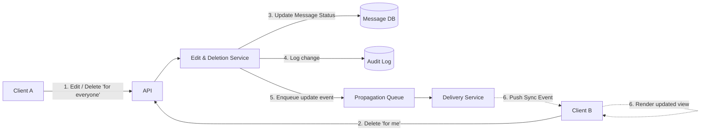
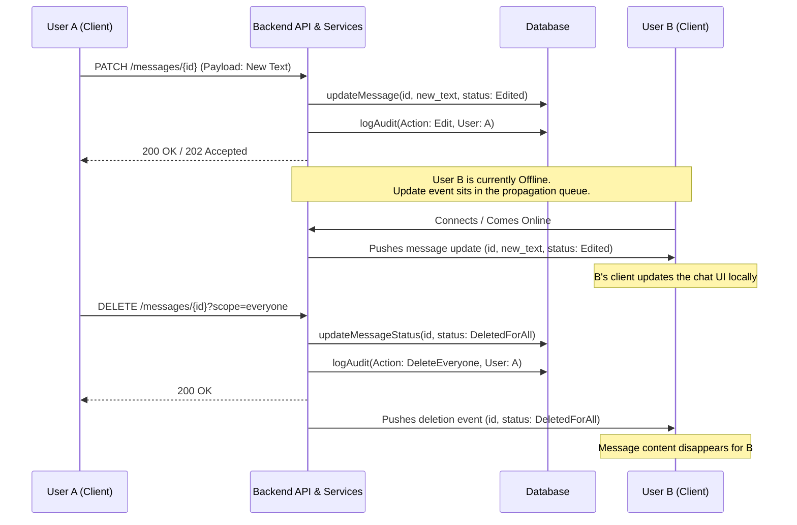
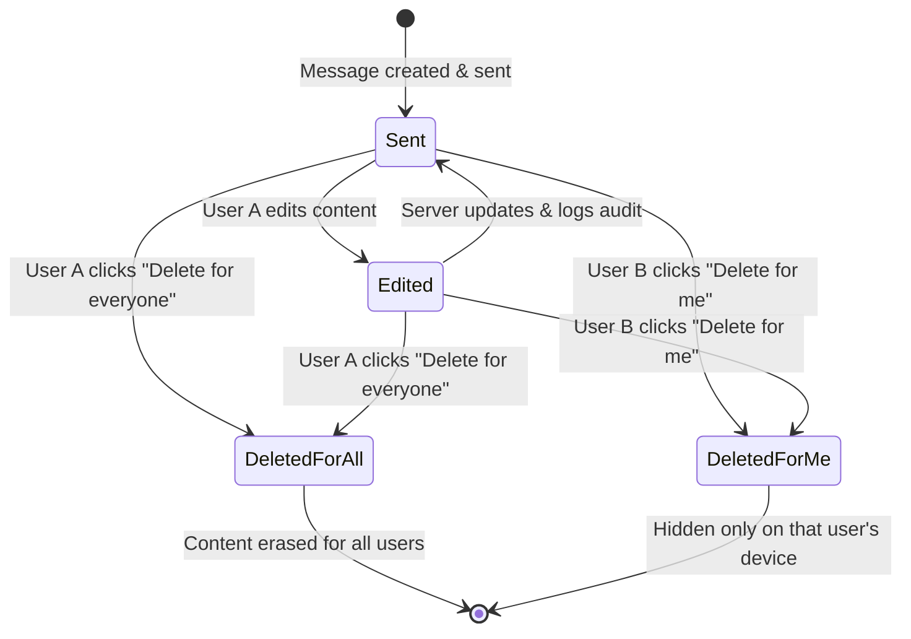

# 🧪 Laboratory Work 1: Variant 6
Зробив студент групи Б-121-24-3 ПІ
Світличний Дмитро Євгенович
## Designing a Messaging System
### 🎯 Goal
Learn how to:
- design software systems before coding;
- reason about architecture and responsibilities;
- use Component, Sequence, and State diagrams;
- document decisions using RFC and ADR.

---

## 🧠 Context

You are designing a minimal messenger system that supports:
- sending messages between users;
- asynchronous delivery;
- message statuses (sent / delivered / read);
- offline users.

---

## 🧩 Functional Requirements
1. A user can send a message to another user.
2. Each message has a lifecycle.
3. The system must:
  - store messages,
  - deliver them asynchronously,
  - update delivery status.
4. The recipient may be online or offline.

---

## 🧱 Part 1 — Component Diagram

### Task


---

## Part 2 — Sequence Diagram

### Task


---


## Part 3 — State Diagram

### Task


---

## Part 4 — Architecture Decision Record (ADR)
```markdown
# Mechanism for Message Editing, Scoped Deletion, and Audit Logging

## Status
Accepted

## Context
In our messaging system, users must be able to edit sent messages and delete messages under two distinct scopes: "Delete for me" (hiding it on their own device) and "Delete for everyone" (removing it from the entire conversation). 

The primary challenge is ensuring eventual data consistency across client devices that may be intermittently offline, while simultaneously maintaining system auditability (the ability to trace actions in case of support tickets or system discrepancies) without infringing on baseline security expectations.

## Decision
- **Identification & Status Fields:** Every message payload will feature a immutable `UUID` and a mutable `status` state (`Sent`, `Edited`, `DeletedForAll`).
- **Editing Flow:** Edits trigger a `PATCH` request. The backend updates the string record in the database, sets the status flag to `Edited`, logs the transactional trace, and forwards a synchronization payload to the distribution queue.
- **Dual-Scope Deletion:**
  - **Delete for Everyone:** The server physically replaces or blanks out the message contents in the central database table, applies a `DeletedForAll` state, and pushes a higher-priority cache-busting sync event to all active/inactive chat members.
  - **Delete for Me:** The message body is not mutated. Instead, a relational table/visibility map (`user_hidden_messages`) links the `user_id` and `message_id`. The querying user's client uses this map to dynamically exclude the item from their local history view.
- **Audit Logging:** Every mutating action (the modification string metadata, the deletion requests, timestamps, and initiating user IDs) is stored in a isolated, read-heavy append-only audit tracking datastore.

## Consequences
+ **Eventual Consistency:** Relying on distribution queues ensures offline clients perfectly align their interface state to matching server statuses immediately upon reconnection handshakes.
+ **Auditability:** The append-only ledger gives administrators clear operational trace records to debug race conditions, system health bugs, and user reports reliably.
- **Client Logic Overhead:** Frontend application runtimes are forced to listen closely to metadata broadcasts and handle complex dynamic canvas re-renders when a payload turns into an `Edited` or `DeletedForAll` stub.
- **Database Index Strain:** Managing dynamic mapping constraints for individual "Delete for me" actions requires extra index management to avoid bloated lookup loops as message history expands.
```